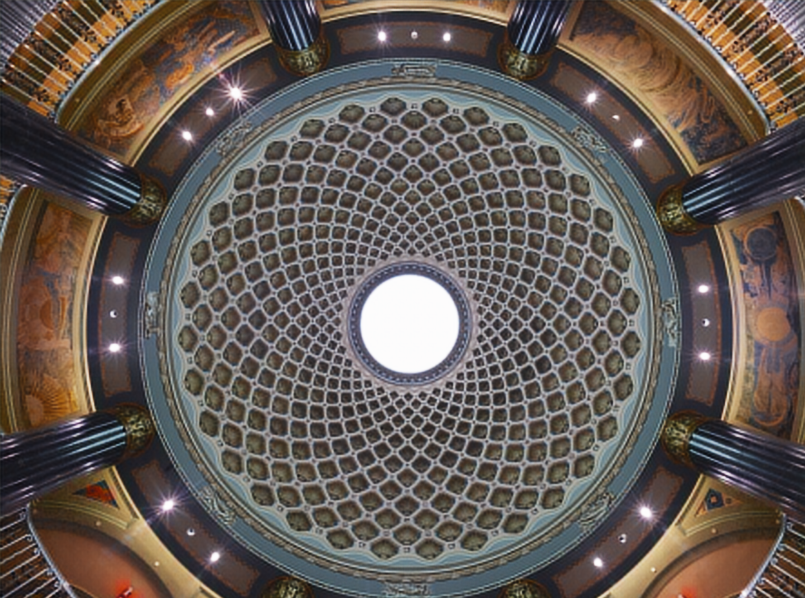

# Deep Learning Method in Image Compression

In this project, we use Autoencoder and GAN to tackle this problem. We train our models on **DIV2K** dataset and evaluate the performance on JPEG AI public test dataset based on PSNR and SSIM.

# Quickstart

```sh
python3 train.py --dataDir path_to_your_training_data 
```

```sh
python3 test.py --dataDir path_to_your_testing_data --encoderWeight ./checkpoint/encoder.pt --decoderWeight ./checkpoint/decoder.pt
```

# Evaluation
|     Original      |                 Reconstructed                  |
| :---------------: | :--------------------------------------------: |
|  |                            |
|      5.6 MB       | Compressed to 774 KB (PSNR: 24.57, SSIM: 0.59) |
|  |                            |
|      4.7 MB       | Compressed to 627 KB (PSNR: 22.54, SSIM: 0.66) |
|  |                            |
|      6.2 MB       | Compressed to 887 KB (PSNR: 29.52, SSIM: 0.68) |
|  |                            |
|      12.9 MB      | Compressed to 2.3 MB (PSNR: 26.86, SSIM: 0.80) |


